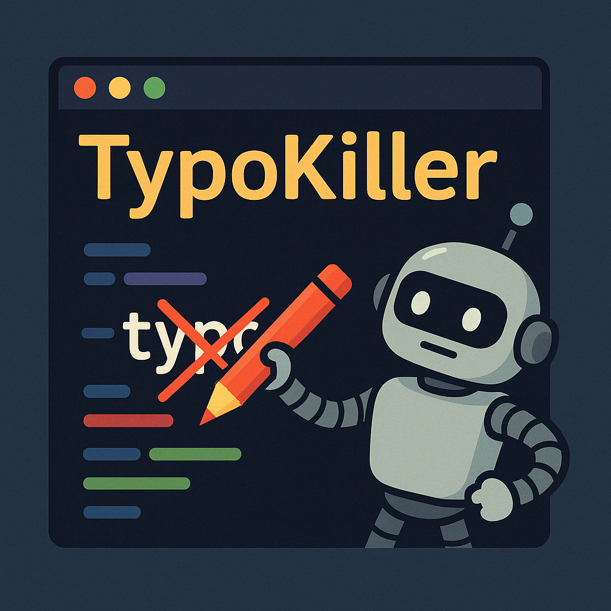

# TYPO Killer
####  Have your patch files read aloud to catch typos before you commit.

**Typo Killer** is a simple Single Page Application (SPA) that runs in the browser and reads patch files aloud. For some people—myself included—hearing mistakes can be easier than spotting them while reading.

This application is written in [Next.js](https://nextjs.org/).

## Features

- 📂 Open or drag-and-drop files into the browser
- ➕ View only additions or review the entire patch
- 👨‍💻 Programmer-specific words and symbols (e.g., `!`, `not`)
- 🎚️ Variable speed controls
- ✨ Highlighting of the currently spoken line

## Version 0.1.0 Goals

- 🌍 Multi-language support
- 🔠 Word-by-word highlighting
- 🧠 Improved patch-to-speech translation
- ⏩ Navigation support (e.g., jump forward/back by line)
- 📝 Inline editing  

